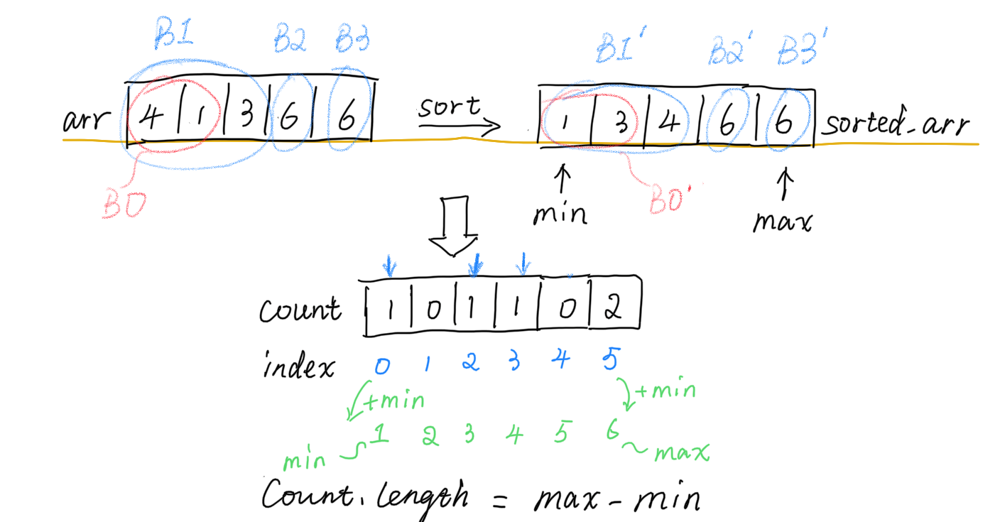

# Solution 1 计数 [^1]
## 思路
借鉴了Counting Sort, Bucket Sort




计数数组count: 数组的索引表示值，数组的值表示其对应的出现次数。
为了节省空间，虽然count的index是从0开始，但我们可以加上一个偏移量(arr中的最小值min)，
这样count[0] = 1就表示1在arr中出现了1次。count的长度为max-min+1

如果一个块能单独排序，那么它在arr中位置和排序后在sorted_arr的位置一样。

所以对于arr中任意一个块B，其在sorted_arr中对应位置的块是B'，比较B和B'中元素在count中的值。
- 如果都相等，说明它们其实是同一个块。B可以单独排序。比如B1和B1'
- 如果不相等，那继续扩大块B的范围。比如B0和B0'

> Crux:  如果两个数组的计数信息是一致的，那么两个数组排序后的结果也是一致的

那么如何比较两个块对应的count内容呢？
能单独排序的blocks必然是连续的，且它们在arr和sorted_arr中的位置相同，它们对应的count相同。
故而可以先声明两个计数数组，从第一个元素开始遍历arr和sorted_arr，并更新两个计数数组。

- 一旦两个计数数组相等了，说明我们又遇到了一个新的可排序块
- 不相等就继续

因此步骤如下：
1. sort arr -> sorted_arr
2. traverse arr
3. if arr[:i+1]‘s corresponding count array == sorted_arr[:i+1]'s corresponding count array， 
   说明我们得到了一个新的可排序的块，ans++ 

arr[:i+1] 指的是 arr 的切片，从索引 0 到 索引 i 的一个切片。
## code 
```cpp
 int maxChunksToSorted(vector<int>& arr) {
     vector<int> sorted_arr = arr;
     sort(sorted_arr.begin(), sorted_arr.end());
     int n = arr.size();
     int min = sorted_arr[0], max = sorted_arr[n-1];
     int len = max - min + 1;
     vector<int> count1(len, 0), count2(len, 0);
     int ans = 0;
     for(int i = 0; i < n; ++i){
         count1[arr[i]-min]++;
         count2[sorted_arr[i]-min]++;
         if(count1 == count2)
             ans++;
     }
     return ans;
 }
```
T: count1和count2比较需要O(N)， 总O(N^2)
S: >O(N), O(max-min+1)更为准确
以上代码TLE

## Improve
不需要两个计数数组，只需要一个计数数组count，arr增加count元素的值，sorted_arr则减少count元素的值。
记录count中不为0的元素个数。如果是0，说明遇到了一个新的可排序块。

```cpp
 int maxChunksToSorted(vector<int>& arr) {
     vector<int> sorted_arr = arr;
     sort(sorted_arr.begin(), sorted_arr.end());
     int n = arr.size();
     int min = sorted_arr[0], max = sorted_arr[n-1];
     vector<int> count(max - min + 1, 0);
     int non_zero_cnt = 0;
     int ans = 0;
     for(int i = 0; i < n; ++i){
         int a = arr[i]-min, b = sorted_arr[i]-min;
         
         count[a]++;
         if(count[a] == 0) 
             non_zero_cnt--;
         else if(count[a] == 1) //注意一旦一个元素不为零，我们只用cnt++一次
             non_zero_cnt++;
         
         count[b]--;
         if(count[b] == 0)
             non_zero_cnt--;
         else if(count[b] == -1) //同上
             non_zero_cnt++;
         
         if(non_zero_cnt == 0)
             ans++;
         
     }
     return ans;
 }   
```
T: 排序是决定因素 O(NlogN)，faster than 5.27%
S: 减少了，但仍然是O(max-min+1)，less than 5.27%

# Solution 2 单调栈 [^1]

- 如果arr是递增的，答案是arr的长度
- 如果arr是递减的，答案是1
- 这个观察可以推广到subarray

> Crux: 找到从左到右连续递减的subarray，可以只有一个元素，每一个subarray就是一个块

比如[2,1,3,4,4]: [2, 1], [3], [4], [4]

corner case: [1,1,1]，虽然也是递减，但却有3个块

但如果只是靠比较相邻两个元素来找递减的subarray，是不对的。比如[4,2,2,1,1] 

> 因为把数组分成数个块，分别排序每个块后，组合所有的块就跟整个数组排序的结果一样，这就意味着后面块中的最小值一定大于前面块的最大值,这样才能保证分块有效。因此直观上，我们又会觉得是不是”只要后面有较小值，那么前面大于它的都应该在一个块里面“，实际上的确如此。

**融合区块**

比如 [2,1,3,4,4]，遍历到 1 的时候会发现 1 比 2 小，因此 2， 1 需要在一块，我们可以将 2 和 1 融合，并**重新压回栈**。那么融合成 1 还是 2 呢？答案是 2，因为 2 是瓶颈，这提示我们可以用一个递增栈来完成。

因此本质上**栈存储的每一个元素就代表一个块，而栈里面的每一个元素的值就是块的最大值**。

以 [2,1,3,4,4] 来说， stack 的变化过程大概是：

- [2]
- 1 被融合了，保持 [2] 不变
- [2,3]
- [2,3,4]
- [2,3,4,4]

简单来说，就是**将一个减序列压缩合并成最该序列的最大的值**。 因此最终返回 stack 的长度就可以了。

```cpp
int maxChunksToSorted(vector<int>& arr) {
    stack<int> stack;
    for(int i =0;i<arr.size();i++){
        // 遇到一个比栈顶小的元素，而前面的块不应该有比 a 小的
        // 而栈中每一个元素都是一个块，并且栈的存的是块的最大值，因此栈中比 a 小的值都需要 pop 出来
        if(!stack.empty()&&stack.top()>arr[i]){
            // 我们需要将融合后的区块的最大值重新放回栈
            // 而 stack 是递增的，因此 stack[-1] 是最大的
            int cur = stack.top();
            // 维持栈的单调递增
            while(!stack.empty()&&stack.top()>arr[i]){
                stack.pop();
            }
            stack.push(cur);
        }
        else{
            stack.push(arr[i]);
        }
    }
    // 栈存的是块信息，因此栈的大小就是块的数量
    return stack.size();
}
```

**复杂度分析**

- 时间复杂度：O(N)O(N)，其中 N 为数组长度。
- 空间复杂度：O(N)O(N)，其中 N 为数组长度。

## 总结

实际上本题的单调栈思路和 [【力扣加加】从排序到线性扫描(57. 插入区间)](https://leetcode-cn.com/problems/insert-interval/solution/li-kou-jia-jia-cong-pai-xu-dao-xian-xing-sao-miao-/) 以及 [394. 字符串解码](https://github.com/leetcode-pp/91alg-2/blob/master/solution/basic/d4.394.decode-string.md) 都有部分相似，大家可以结合起来理解。

融合与[【力扣加加】从排序到线性扫描(57. 插入区间)](https://leetcode-cn.com/problems/insert-interval/solution/li-kou-jia-jia-cong-pai-xu-dao-xian-xing-sao-miao-/) 相似， 重新压栈和 [394. 字符串解码](https://github.com/leetcode-pp/91alg-2/blob/master/solution/basic/d4.394.decode-string.md) 相似。

# Solution 3 [^2]
[^1]: https://algo91.herokuapp.com/solutionDetail?type=3&id=6&max_id=2
[^2]: https://zxi.mytechroad.com/blog/algorithms/array/leetcode-768-max-chunks-to-make-sorted-ii/